# Galaxseeing by Commit & Pray

**Team:** Koh Vy San, Hayley Chan Li Qing, Janani a/p Pragash, Josh Jonathan Jones  
**Problem Statement:** Travel Planner  
**Video Presentation:** [https://www.youtube.com/watch?v=FowJe-maFjg]  
**Presentation Slides:** [https://canva.link/tbrl0r30jypqnad]  

 

## 1. Project Overview

### The Problem
Trip planning is often overwhelming and time-consuming because existing platforms typically address only isolated aspects of travel such as bookings, itineraries, and budgeting, forcing users to manually piece everything together across multiple platforms. Group trips make this friction even worse, since getting everyone's schedule, individual budgets, personal preferences to line up together is difficult. While current market solutions such as Trip.com, Tripadvisor, Wanderlog, Triplt or AI assistants provide booking or basic itinerary drafting, they just lock users into a rigid, one-way schedule, not flexible. And if something suddenly goes wrong or changes mid-trip, none of those apps actually help you adjust on the plan.

### Our Solution
Galaxseeing is a collaborative travel planner platform framed around space-exploration themes that turn travel planning into a flexible dynamic decision tree. Instead of forming a single rigid schedule, Galaxseeing generates a main travel route pair with branching backup paths for every day of the trip. In addition, an AI assistant named Autopilot synthesizes group chat inputs, social links, locations to get users' preferences for the trip, real-time data to estimate cost, compare options, align individual budgets, generate planets (as destinations) and host minigames to choose the main path from multiple options. During the trip, travelers can seamlessly switch routes, upload bills, track their live location, journal and take photographs, and finally view an end-of-trip recap.

#### Features:
* Space-Themed Interactive Decision Tree (with sub-group branching)
* AI Group Chat Assistant with Smart Inputs (social media link to destination conversions, messages and voice messages)
* Gamified Decision Making
* Edit Mode and Trip Mode
* Dynamic Plan Changes / Rerouting
* Live Location Tracking
* Expenses Tracking and Bills Uploading
* Journaling and Trip Recap

 

## 2. Ideation & Process

### 2.1 Ideas We Considered

| Idea | Decision | Why it was dropped / kept |
| :--- | :--- | :--- |
| **Interactive Decision Tree Travel Planner** | Chosen | The main concept for the application revolves around an interactive travel itinerary where potential travel locations branch out to more locations in a decision tree format. Each location is connected by lines which represent the travel method such as by public transport, e-hailing, etc. It's a unique concept as opposed to a singular strict travel itinerary or confusing calendar layouts, and allows users to ideate and create infinite possible paths based on infinite potential situations, or reroute on the fly. |
| **Planetary App Concept** | Chosen | The theme of the app would revolve around aliens travelling planets on a spaceship. Each location is represented by a planet. Each user is represented by a cute alien. Together they travel the galaxy in a spaceship, finding new planets and creating new stories. |
| **Sub-groupings in decision tree** | Chosen | From a thematic standpoint in relation to a travel planning app, aliens travelling through space and surveying new planets matches the idea of tourists visiting a new area, and it creates a more exciting/gamifying experience for users. Allows users to split up into sub-groups/go solo during their trip. During trips with large groups of people, it is rare to have everyone following the exact same itinerary, this allows users to follow their preferences without sticking with the whole group. |
| **Main route in decision tree** | Chosen | While a travel itinerary with infinite possible routes and paths is exciting, some users who are more organized may want to pick a main concrete route that they can stick along to reduce any headaches or confusion between members of the trip. Thus, they are allowed to select a main route, but still can deviate from the main route on their trip through dynamic plan changes (explained later on). |
| **Edit Mode and Trip Mode** | Chosen | Separates the "edit itinerary (decision tree)" mode from the "On the trip viewing" mode. More convenient for users who do not want to accidentally change the itinerary while on the trip, but still have the option to do so if needed. |
| **Textual based Chatroom with AI Assistant** | Chosen | This feature allows users to communicate from within the app, especially when it's related to the trip. Using this chatroom makes it a "single source of truth" for the entire trip where all information related to the trip should be entered into the chatroom. The incentive for users to use this chatroom instead of other social media apps when doing discussions for the trip is the presence of the AI assistant Autopilot AI. The AI will update the travel itinerary based on destinations mentioned in the chatroom, and users can even enter Tiktok, google maps or instagram links that discuss potential destinations, where the AI will generate planets and place them in the itinerary. |
| **Voice Messaging in Chatroom** | Chosen | Instead of live voice calls, voice messaging streamlines chatroom discussions while still allowing users to verbally submit information for AI processing. Best of all, users can still seamlessly stay connected and discuss with their friends in the same chatroom. |
| **"Spaceship Race Timer" Gamification in planet (location) selection** | Chosen | Gamifies planet selection when users are not able to decide what locations they should go on the trip. Groups planets under similar categories such as "Hotel, Restaurant, etc" and gamifies to select which planet shall be part of the main route. All the planets will still be included in the decision tree, just that the planet that wins the "Spaceship Race Timer" game will be selected in the main route of the travel itinerary. |
| **Expense Tracking and Bill Uploading** | Chosen | Allows users to track both estimated expenses and actual spending when the trip begins. Estimated Expenses: fetches pricing data (transport, accommodation, food & beverage) from online, as well as users input of their own budget to come up with an estimated spending summary. Trip Spending: allows users to upload their bills when leaving a destination to create the final spending summary, automatically comparing the total against their budget to track if they stayed under or went over budget. |
| **Dynamic Plan Changes during Trip Mode** | Chosen | Allows users to deviate from the main route and plan based on the current situation during their trip (such as emergencies, bad weather, etc.). Users can reroute to different paths in their decision tree, or create entirely new paths if users find that the currently existing paths are not enough. |
| **Live Location Tracking** | Chosen | Allows users to track their location from within the app and match it with the current travel itinerary. Allows them to view their fellow tripmates locations, as well as view the upcoming location they plan to travel to based on the main route selected in the decision tree. They can also view travel details, such as estimated pricing, travel time and current conditions affecting travel (ex. Bad weather). |
| **Photo Taking and Journalling during Trip Mode** | Chosen | Allows users to store memories in the app as they follow along the itinerary, or even if they reroute to different locations. Users can add photos of their stay at the destination, and keep different notes of their stay called journal entries. This will all be compiled into the final trip recap. |
| **Final Trip Recap** | Chosen | A trip recap based on the photo taking and journaling done by the users, and summarizes all the destinations that they travelled to during their trip. Personalizes the users experience and creates something the users can be fond of and look back on. |
| **Video Calling with AI Assistant** | Rejected | Issues of the AI assistant potentially being unable to correctly recognize voices when microphone has issues, or due to incorrect voice recognition, creating the wrong planet. If the application utilizes a chatroom instead of a video call, the AI could potentially process links from social media websites like tiktok, instagram that are pasted into the chatbox, which are fairly important in the modern day as people often use it for their travel plans. In the application, there will instead be a chatroom with voice messaging features that acts as an option for users to communicate verbally. |
| **"Pacman" style game for planet (location) selection** | Rejected | The application should not be bloated with too many game related features. For planet selection, only one style of game should be chosen so as to not confuse users, especially more advanced games that some users might not understand. The chosen game for planet selection was "Spaceship Racing Game". |
| **"Spin the Wheel" style game for planet (location) selection** | Rejected | The application should not be bloated with too many game related features. For planet selection, only one style of game should be chosen so as to not confuse users. The chosen game for planet selection was "Spaceship Racing Game". |
| **"Space Invaders" style game for planet (location) selection** | Rejected | The application should not be bloated with too many game related features. For planet selection, only one style of game should be chosen so as to not confuse users, especially more advanced games that some users might not understand. The chosen game for planet selection was "Spaceship Racing Game". |
| **Bakery Store Stress Manager** | Rejected | Uses a kanban board and calendar where users can add tasks, events, and routines to calculate workload. Workload calculation is complex and could be affected by too many factors, where some of them cannot be estimated accurately through numbers. Users might forget or be unmotivated to add tasks or events often, leading to poor workload estimates. May cause users to feel unproductive when their pastry stock has been full for a long time. |

---

### 2.2 Ideation Boards

#### Brainstorming Mindmap
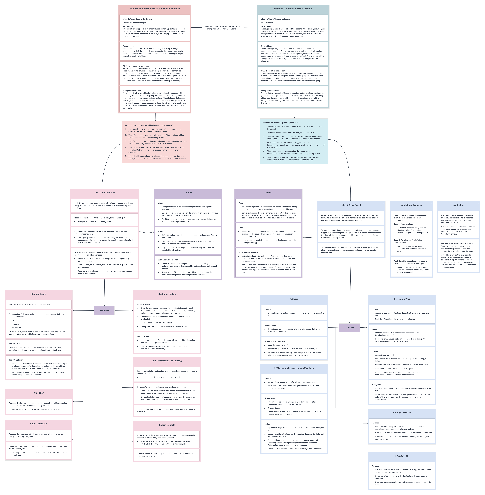

This was our first mindmap created during the brainstorming session to come up with several ideas for the app. We analysed the current stress & workload management and travel planner apps in the market, then listed out their primary usages and shortcomings. From this evaluation, we came up with two main ideas, one for each problem statement. Each idea includes its features, pros, cons, and final decision of whether we accepted or rejected the idea.

*If the mindmap is not clear enough please download the file 'Brainstorm-Mindmap.pdf' under the github repository for a clearer view of the mindmap.*

 

#### Galaxseeing / Story Board Mindmap
After the Brainstorming Mindmap, we chose to go with the second idea, Story Board (now called Galaxseeing). We had several iterations of the mindmap as the idea kept evolving alongside our mentors' feedback throughout each session.

*If any of the mindmaps are not clear enough, please download the file 'All-Galaxseeing-Iterations-Mindmaps.pdf' under the github repository for a clearer view of the mindmaps.*

##### 1. First Iteration
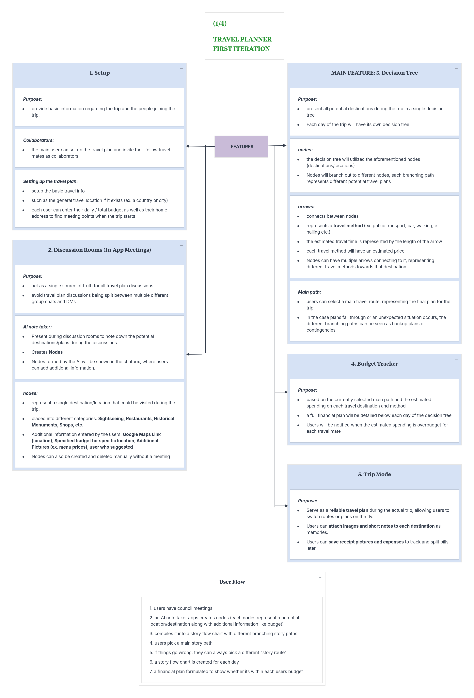
The first version of our mindmap is similar to the one from the Brainstorming Mindmap earlier. It briefly explains the features of the app based on the user flow (Setup -> Discussion Rooms -> Decision Tree -> Budget Tracker -> Trip Recap). 

##### 2. Second Iteration
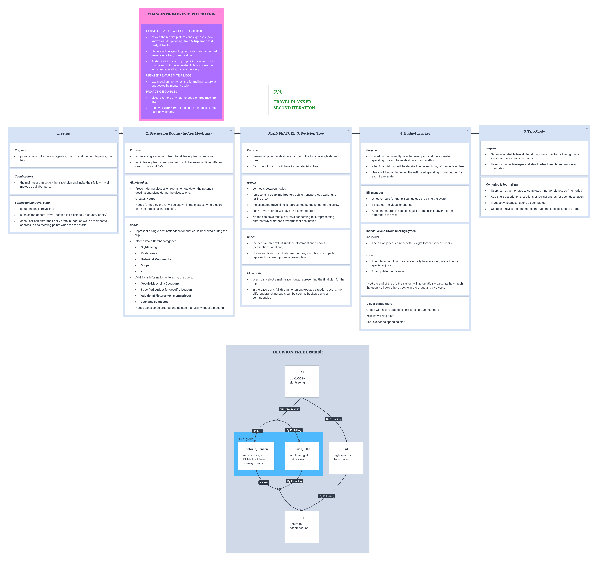
Then, we expanded on the ideas, mainly the budget tracker and trip mode, and further explained the other features to define what the app does. We also created a basic example of how the decision tree would look like.

##### 3. Third Iteration
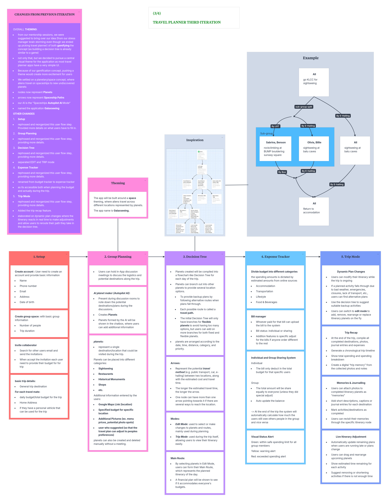
This iteration had the biggest changes as we decided to wrap our entire idea in a more interesting concept, namely a space theme. We added more gamification elements and further defined all the features.

##### 4. Final Iteration
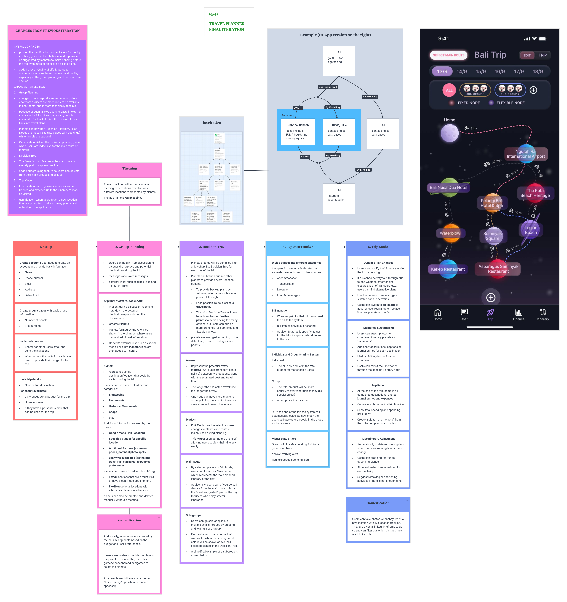
Lastly, we finalised the mindmap by pushing the gamification concept even more and added new cards to clearly state how they relate to the features. After finishing up this final iteration, we heavily relied on it as reference to create the user interface of our app in Figma.

---

### 2.3 Mentor Consultation

| Date | Mentor | Feedback Received | What Was Changed |
| :--- | :--- | :--- | :--- |
| 5/9/2026 | Varsha Selvakumar | Presented two initial problem statement ideas: Study stress management app with a bakery-themed interface, Cohesive travel planning app. Sought Varsha's opinion on which concept had greater potential. • Varsha found the travel concept promising but suggested making it more engaging and technically distinctive. • Suggested incorporating the gamification and visual elements from the bakery concept into the travel app. • Recommended adding live features, such as live location tracking, real-time transportation pricing. • Suggested expanding the app beyond pre-trip itinerary planning to support users during their actual trip. | Proceeded with the travel planning application instead of the study stress manager. • Introduced a gamified and interactive UI inspired by the bakery concept. • Added live, real-time picture journaling for users to capture their travel experiences. • Shifted the concept beyond a basic itinerary planner towards a more cohesive and interactive travel experience. |
| 8/9/2026 | Faris Imran | Consulted Faris to evaluate the technical feasibility of the travel application. • Suggested integrating an AI assistant directly into the group chat. • Users can call the AI in the chat to ask travel-related questions, check if destinations or activities are suitable, share links for the AI to analyse, receive travel recommendations. | Shifted from a voice-room-based planning approach to an AI-integrated group chat. • Added the concept of users calling the AI within the group chat for travel suggestions and link analysis. |
| 9/9/2026 | Kueh Pang Teng | Suggested using the AI to listen to real-life group conversations and extract important travel details. • Recommended keeping the collaborative interface simple and user-friendly. • Suggested using building/nodes instead of excessive customisation. • Users can easily add information or create new levels of their travel plan collaboratively. • Recommended using React Native as the main tech stack. • Suggested React Three Fiber to add interactive 3D elements to the frontend. • Suggested using the Grok API with a free model for the AI note-taking feature. • Recommended using OpenStreetMap API for location data. • Suggested using ChatGPT to explore and validate the most suitable technical stack. • Encouraged us to focus more on an interactive and engaging UI, while keeping the backend development simpler. • For the YouTube video, advised us to highlight 3 unique points that differentiate our app, emphasise how we make travel more fun and gamified, show that the app also functions as a navigator/map, include demo clips, competitive analysis, the problem being solved, and feedback received. • Recommended ensuring that all features and games connect together as one ecosystem, rather than feeling like separate functions. | Expanded the AI's role to potentially extract travel information from real-life conversations. • Simplified the collaborative planning UI by using building blocks/nodes instead of excessive customisation. • Made the planning process more collaborative and interactive, allowing group members to build their itinerary together. • Selected React Native as the main development framework. • Planned to use React Three Fiber for interactive 3D elements in the UI. • Chose Grok API for the AI note-taking feature. • Planned to use OpenStreetMap API for location data. • Shifted focus towards a more interactive and engaging UI, while keeping the backend simpler. • Refined the app's USP and presentation around 3 key points: gamified travel, navigation, and collaborative planning. • Planned to include demo clips and competitive analysis to clearly show how the app stands out. • Connected the different features and games into one travel ecosystem instead of treating them as separate features. |

 

## 3. Design & Prototype

**UI Prototype (Figma):** [https://www.figma.com/design/wh4WnFMWa859B8J9VhsENy/Galaxseeing?node-id=4-54&t=At2saD7qN2yeTfpt-1]

#### Main Menu:
The first page a user sees when they enter the app, displaying their upcoming and previous trips. For each trip, they can choose to enter the decision tree page in the Edit Mode or Trip Mode.
 

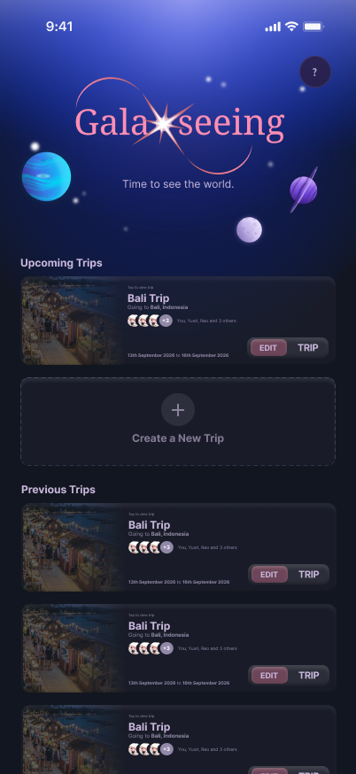

#### Setup form:
This is where users first create their trip, invite collaborators, set their individual budgets and preferences, as well as pick their travel personalities.
 

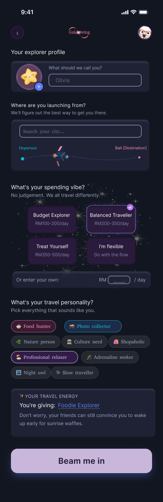

#### Group Chat Meeting Room:
Users can discuss their travel plans and send social media links of locations they want to visit, while an AI creates new locations in the decision tree based on the messages. When there are several locations in the same category, the app starts a game for users to compete between their preferred locations.
 

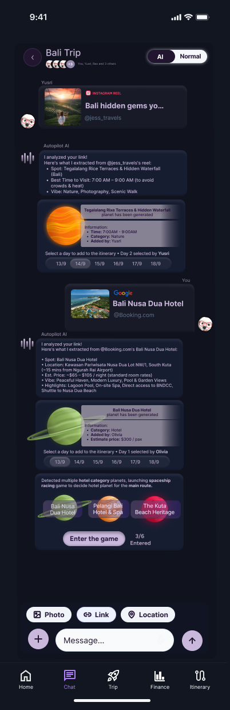

#### Decision Tree:
This is the decision tree where users can add and remove locations, form sub-groups if they want to split up, and select their main route of choice. Every route between two planets shows the transportation option and travel time. Each planet (location) can be clicked to show a pop-up with more information.
 

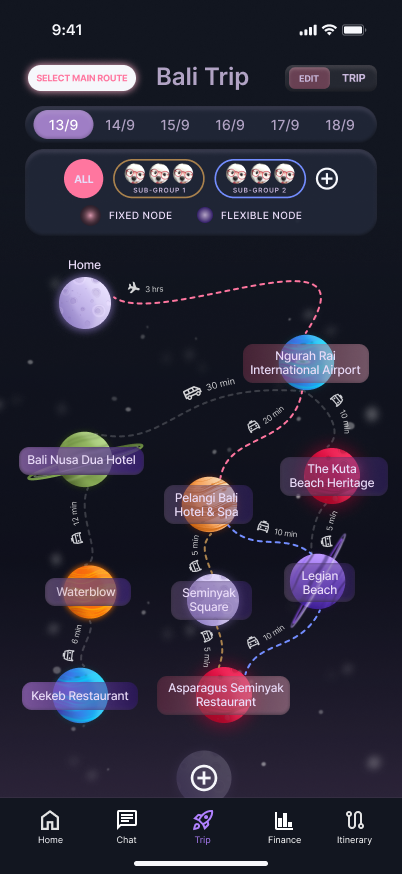

#### Financial Plan:
Users can see the total estimated cost required for the trip, showing whether each member remains within budget or exceeds it.
 

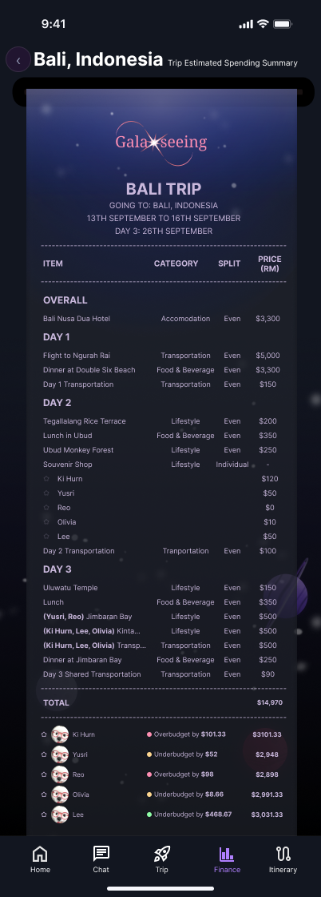

#### Trip Recap:
This appears after the trip is over, showing a summary of total spendings, journals, and photographs for all members to look back on.
 

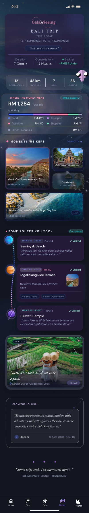

#### Live Location Tracking:
Used during the trip itself to display where each member is at the moment and details of the next location in the itinerary.
 

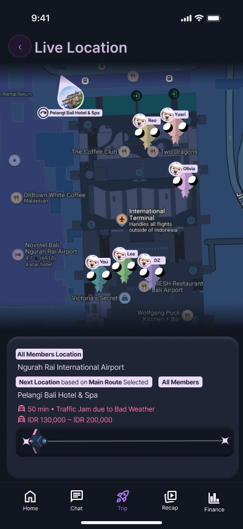

#### Photo Taking and Journaling:
For each location, members can take photographs and write journal entries to record their memories of being there.
 

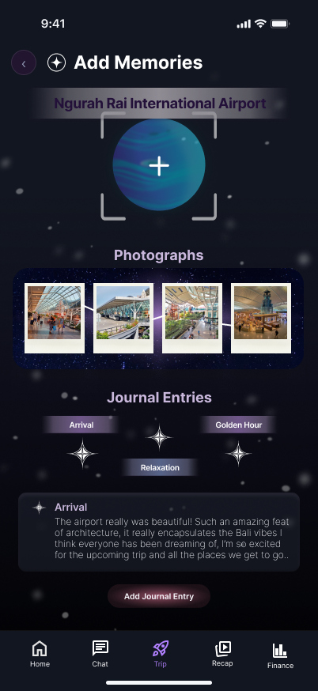

## 4. What Makes It Different

| Feature | Original | Twist and Improvement |
| :--- | :--- | :--- |
| **Galaxy-themed Interactive Decision Tree Travel Planning** | Standard travel planning apps such as TripAdvisor, Wanderlog, Triplt creates rigid schedules with no room for deviating from the main path, users must follow exact routes built for them just by going off the travel itinerary in these apps. Additionally, these apps have very simple, basic UI. Travel planning with friends should be a fun and exciting experience even before the trip starts. | Implements a galaxy themed decision tree concept for travel planning: • **Galaxy Theming:** Follows the idea of "aliens travelling through space finding new planets in their rocket ship". Each planet represents the destination that the aliens representing users can travel to. • The travel itinerary is made up of planets connected to each other by spaceship routes. • **Decision Tree Travel Planning:** each planet branches out into multiple different planets, allowing users to have multiple potential locations they can travel to depending on the circumstances during their trips, creating infinite potential travel routes. • Connecting between planets are the spaceship routes which represent the travel method to that destination (such as by public transport, e-hailing, flight, personal car, etc.). • Users can still pick a "main route" optionally, but during their trip they can still choose to reroute if necessary. • **Gamification:** combining the decision tree and the galaxy theming, it gamifies the whole concept of travel planning, this is in line with the entire app's concept. The fun and bonding can begin even before the trip begins. • **Edit Mode and Trip Mode:** User experience can be separated into edit mode and trip mode. Users can freely switch between modes, but users are suggested to only switch to trip mode when the trip begins.   * **Edit mode:** allows users to directly edit the itinerary, gamification features to select destination planets, estimated spending summary.   * **Trip Mode:** Users can view the itinerary, dynamic plan changes, photo taking and journaling forms to form the trip recap, live location tracking, spending summary based on bill uploading. • **Dynamic Plan Changes:** as the trip is happening, users can decide to reroute based on current circumstances and emergencies, either to preexisting routes in the decision tree, or even new locations suggested by Autopilot AI. • **Live Location Tracking:** during the trip, users' locations will be tracked and matched up with the itinerary to provide details on the next stop and the exact location of each travelmate. |
| **Chatroom** | In standard travel planning apps such as Wanderlog, Triplt and even Google Calendar, there are no built-in communication or instant messaging features. | Implements a chatroom directly into the app. • Users can send either text or voice messages and communicate to each other. • Acts as a "single source of truth" for travel plan related discussions for users. • Users are incentivized to use the chatroom to discuss travel plans in-app instead of through social media via the AI assistant named "Autopilot AI". • Autopilot AI will create planets (locations) and implement it directly into the travel itinerary. • Users can send social media links of places they are interested in going into the chatroom. These links can be any external link (websites, instagram, tiktok, Google Calendar, etc.) and the AI will create planets (locations). |
| **Gamification of Chatroom** | When groups attempt to plan trips via external messaging apps (such as Whatsapp, Instagram,...), discussion often collapse into decision paralysis, endless back-and-forth debates, and conflict personal preferences causing planning friction before the trip even starts. | Integrated space-themed decision mini-games directly into the group chat to quickly resolve ties whenever travelers face multiple choices. • **Smart Minigame Triggers:** when group members suggest, competing or similar locations, restaurants or attraction or simply can't decide where to go next, Autopilot AI automatically activates interactive mini-games to help make the decision. All suggested locations are included in the decision tree, but only one is part of the main route. • **Rocketship Racing:** when members suggest competing destination planets or routes, a Rocketship Race is triggered in the chat. Each player's space shuttle represents a different destination choice. • **Interactive Tapping Mechanic:** Group members rapidly tap their screens to speed their chosen rocketship. The destination attached to the fastest rocket ship wins and gets locked into the main travel paths. • These replace the chat debates and decision into a quick competition game, making itinerary decisions fast, fair, and fun before the trip even starts. |
| **Expense Tracking and Bill Uploading** | Standard trip planning app they either lack of financial tracking feature or some of the existing travel expense apps like Splitwise or Tricount operate separately from travel itineraries and require manual item-by-item input, leading to unexpected overspending and tedious post-trip math. | Integrates Expenses and Bill features within the app that combines real-time budget tracking with automated bill splitting. • **Pre-Trip Budget Setup and Estimate budget:** users can set individual total trip budgets during setup. Before the trip even begins, Galaxseeing will calculate an estimated overall trip cost based on selected routes and planned destination so travellers know what to expect. • **Real-time Budget Tracker:** features a live spending tracker that updates as expenses occur, visually alerting travelers whether they are staying under budget or going over budget. The app also have an alert when showing the people spending using red for overbudget, yellow is a bit over budget or almost overbudget and green or underbudget still good to go. • **Bill Upload and automated even splitting:** users can snap and upload the receipts into the central bill manager. The app automatically extracts the total bill amount and divides it evenly among group members if the user sets it as a shared bill. • **Custom Individual Adjustments:** for bills that are not split equally, users can easily make manual edits in special note and choose individual buttons, Galaxseeing will calculate and update the expenses. Ensuring accurate and fair expense management. |
| **Photo Taking and Journalling during Trip Mode, Trip Recap** | Standard travel apps like TripAdvisor end at the itinerary part. Once the travel itinerary is set, there are rarely additional features for when the trip is actually occurring, meaning the app is no longer in use outside of checking the itinerary. And when the travelling is over, is the app even needed? | Galaxseeing implements photo taking and journaling features, which is then compiled into a trip recap. • **Photo Taking:** whenever a new planet is reached in the itinerary, users can attach photos they took of that location by clicking an "add memory" button. • **Journalling:** users can add a myriad of journal entries attached to each planet. • **Trip Recap:** finally, the photos taken of the place and the journal entries will be compiled into a full trip recap detailing the adventures the users took on the trip. |

 

## 5. Technical Architecture & Feasibility

### Tech Stack
* **Frontend:** React Native + Expo
  * *React Native* supports mobile development for both Android and iOS using one codebase, while Expo provides pre-configured development tools and libraries.
  * *Constraints:* may require additional native configuration for complicated features.
* **Backend:** Supabase
  * Provides a database, user authentication, file storage, and real-time updates.
  * *Constraints:* free tier has limits, but is still suitable for a prototype.
* **Database:** Supabase PostgreSQL
  * Provides a relational structure with users, trips, locations, expenses, etc.
  * *Constraints:* may not work properly if users travel to places with poor internet connection.
* **Location API:** Google Maps Platform (Places API, Routes API)
  * Provides accurate location, maps, routes, and distance data.
  * *Constraints:* free usage is limited, so API calls will be used only for essential route and location queries.
* **Chatroom AI API:** Google Gemini 2.5 Flash-Lite
  * Free model used to analyse group chat messages and extract location options.
  * *Constraints:* continuous AI usage could increase costs, so light filtering should be applied before sending messages to the AI service.
* **Hosting:** Expo Application Services (EAS) + Supabase
  * To host backend services, build and distribute the mobile app.
  * *Constraints:* may have insufficient resources if the build process requires a lot of memory.

 

### Build Plan & Scope
**Setup & Planning:**
1. Trip creation and setup form
2. Group chat meeting room + Autopilot AI
3. Rocketship tie-breaker game

**Decision Tree:**
1. Edit mode with node creation
2. Main Route selection
3. Sub-group formation
4. Financial plan
5. Travel itinerary

**Trip Mode:**
1. Trip recap
2. Bill uploading
3. Trip Mode with dynamic plan changes
4. Live location tracking
5. Journaling and photo taking feature
